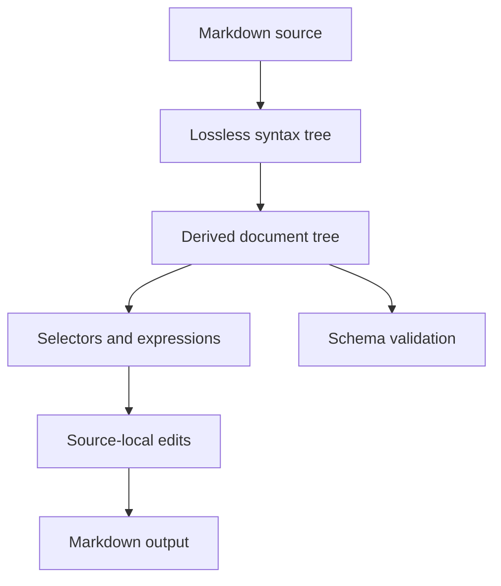

# mq specification

Status: design baseline for the first implementation

Target: `@prelude/mq` and `@prelude/mq-cli` 0.x

## 1. Purpose

`mq` is a language, library, and command-line tool for treating Markdown as
structured data. It should make common document operations as composable as
`jq` makes JSON operations:

- select sections and Markdown nodes;
- extract Markdown, text, or structured JSON;
- create, replace, insert, move, and remove content;
- validate documents against reusable schemas;
- read from files or standard input and write to files or standard output;
- expose the same capabilities as a TypeScript API.

The name describes the intent—“Markdown query”—not compatibility with jq's
syntax or data model.

## 2. Design principles

1. **Markdown remains the source of truth.** Unchanged input must round-trip
   byte-for-byte. A mutation must not reformat unrelated source.
2. **Sections are structural.** A heading owns the content after it and every
   lower-ranked heading beneath it, until a heading of equal or higher rank.
3. **Concrete and semantic trees coexist.** The concrete syntax tree preserves
   spelling and trivia; the derived document tree makes sections convenient to
   query.
4. **Queries do not mutate.** Changes are explicit operations and only reach the
   filesystem when the CLI is given `--write` or an output path.
5. **The library defines behavior.** The CLI adapts arguments, streams, files,
   diagnostics, and exit statuses to the library API.
6. **Invalid input is not disposable.** Unsupported or malformed Markdown is
   preserved as opaque source with diagnostics whenever recovery is possible.
7. **Small primitives compose.** Selectors, projections, edits, and schema rules
   remain independent rather than growing command-specific special cases.
8. **Determinism beats convenience.** Source order, stable diagnostics, and
   explicit ambiguity errors are part of the contract.

## 3. Scope

### 3.1 Initial 0.x scope

- UTF-8 Markdown with BOM and LF/CRLF preservation;
- CommonMark block structure needed for headings, paragraphs, lists, quotes,
  code, HTML, links, images, thematic breaks, and reference definitions;
- GFM tables, task-list items, strikethrough, and autolinks;
- YAML, TOML, or JSON frontmatter represented as a distinct node;
- a lossless concrete syntax tree and a derived heading/section hierarchy;
- CSS-like selectors over the derived tree;
- a small pipeline expression language for projections and edits;
- JSON-compatible Markdown schemas;
- deterministic TypeScript and CLI APIs.

CommonMark and GFM are compatibility targets, not permission to destroy syntax
the parser does not yet understand. Until conformance is complete, unrecognized
extensions must survive as opaque nodes.

### 3.2 Explicitly deferred

- rendering Markdown to HTML;
- executing code blocks or embedded expressions;
- evaluating JavaScript from a query or schema;
- network access and remote includes;
- collaborative editing or incremental text-editor protocols;
- a stable plugin ABI;
- automatic prose rewriting;
- guarantees for non-UTF-8 input.

## 4. Architecture



The concrete syntax tree (CST) owns source ranges and exact lexemes. The derived
tree is an indexed view whose nodes point back to CST ranges. Edits produce a
patch set against the original source; serialization applies non-overlapping
patches rather than printing the entire tree.

### 4.1 Package boundaries

`@prelude/mq` owns:

- parsing and lossless rendering;
- document and section trees;
- selector and expression parsers;
- query evaluation;
- edit planning and application;
- schema loading and validation;
- structured diagnostics.

It must not read files, inspect environment variables, write to standard
streams, or terminate a process.

`@prelude/mq-cli` owns:

- argument parsing and help;
- stdin/stdout/stderr and file I/O;
- glob expansion only when explicitly requested;
- atomic in-place writes and file-mode preservation;
- human, JSON, and quiet diagnostic formats;
- mapping results to exit statuses.

Start with these two packages. Extracting more packages requires a demonstrated
independent consumer or dependency boundary.

### 4.2 Dependency policy

Prefer Node.js built-ins and `@prelude/*` packages. `@prelude/parser` is the
default parser-combinator dependency for selector, expression, and Markdown
grammars. A different runtime dependency is acceptable when implementing the
same behavior locally would create greater correctness or maintenance risk; the
choice must be recorded as an architectural decision in this specification.

## 5. Document model

### 5.1 Source coordinates

Every concrete node has a half-open byte range `[start, end)` and corresponding
one-based line/column positions. Public diagnostics expose UTF-16 columns as
well as byte offsets so editors and terminal tools can both locate text.

The document records:

- original source text;
- optional UTF-8 BOM;
- dominant newline style and mixed-newline occurrences;
- final-newline presence;
- parse diagnostics;
- CST root and derived-tree indexes.

Node identity is stable within one parsed document and across edits that do not
replace that node's concrete range. Identity is not stable across a fresh parse
and must not be persisted in schemas.

### 5.2 Concrete syntax tree

The CST preserves every source byte. Concrete nodes include all recognized
Markdown forms plus whitespace, delimiters, escaping, and opaque recovery
nodes. It distinguishes forms with equivalent meaning, such as ATX and Setext
headings or fenced and indented code blocks.

Inline syntax may be parsed lazily. A block's raw inline range remains
authoritative even after an inline view is requested.

### 5.3 Derived tree

The public derived model begins with these conceptual TypeScript shapes. Exact
field names may evolve during 0.x, but the relationships are normative.

```ts
type MarkdownNode = Document | Section | Block | Inline;

interface Document {
  readonly type: "document";
  readonly preamble: readonly Block[];
  readonly children: readonly (Block | Section)[];
  readonly sections: readonly Section[];
}

interface Section {
  readonly type: "section";
  readonly level: 1 | 2 | 3 | 4 | 5 | 6;
  readonly heading: Heading;
  readonly title: string;
  readonly body: readonly Block[];
  readonly sections: readonly Section[];
  readonly children: readonly (Heading | Block | Section)[];
}
```

`children` is the selector-facing order. A section's heading is its first child,
followed by body blocks and nested sections in source order. Convenience fields
such as `body` and `sections` are filtered views, not separate ownership.

The document preamble contains blocks before the first heading. Those blocks are
also the initial non-section entries in `document.children`. Frontmatter, when
present, belongs to the preamble.

### 5.4 Heading nesting

Heading rank creates section hierarchy using a stack:

1. A heading is nested under the nearest preceding heading with a lower numeric
   level.
2. Before adding a heading, close sections whose level is greater than or equal
   to the new heading's level.
3. If no preceding lower-level heading exists, add it at document level.
4. Missing intermediate ranks do not create synthetic sections.

For this source:

```md
# A
intro
### C
text
## B
```

the derived hierarchy is:

```text
document
└─ section A (level 1)
   ├─ paragraph "intro"
   ├─ section C (level 3)
   └─ section B (level 2)
```

The level-3 section is valid structurally but schema rules may reject skipped
ranks. Changing a heading level reparents affected following sections according
to the same algorithm.

### 5.5 Node kinds and common attributes

Initial selectors recognize these type names:

| Type | Important attributes |
| --- | --- |
| `document` | `path`, when supplied by the caller |
| `frontmatter` | `format` (`yaml`, `toml`, `json`) |
| `section` | `level`, `title`, `slug` |
| `heading` | `level`, `title`, `slug`, `style` |
| `paragraph` | — |
| `blockquote` | — |
| `list` | `ordered`, `start`, `tight` |
| `item` | `checked` (`true`, `false`, or absent) |
| `code` | `language`, `meta`, `fenced` |
| `table`, `row`, `cell` | `alignment`, `header` |
| `link`, `image` | `destination`, `title`, `reference` |
| `html`, `thematic-break`, `definition`, `text` | kind-specific values |
| `opaque` | `reason` |

`title` is decoded plain text. `slug` uses a documented GitHub-compatible slug
algorithm and is computed, never serialized. Duplicate slugs are allowed and
receive no implicit numeric suffix; callers that require uniqueness must use a
schema.

## 6. Selectors

Selectors are CSS-like strings parsed by `@prelude/parser`. They operate over
the derived tree and return nodes in source order without duplicates.

### 6.1 Core syntax

The first selector version supports:

- type selectors: `section`, `heading`, `code`;
- universal selector: `*`;
- attributes: `[level=2]`, `[title="Install"]`, `[checked]`;
- comparisons: `=`, `!=`, `^=`, `$=`, `*=`, `~=`, `>`, `>=`, `<`, `<=`;
- selector lists: `heading, code`;
- descendant and child combinators: `section code`, `section > code`;
- adjacent and general siblings: `+` and `~`;
- pseudos: `:first-child`, `:last-child`, `:nth-child(n)`,
  `:contains("text")`, `:matches(/pattern/flags)`, `:has(selector)`, and
  `:not(selector)`.

Attribute names and type names are ASCII case-insensitive. String values are
case-sensitive. Numeric and boolean attributes use typed comparisons; applying
an ordered comparison to a nonnumeric attribute is a selector type error.

`:contains` searches decoded plain text recursively. `:matches` uses JavaScript
regular-expression syntax but rejects unsupported flags and invalid patterns at
parse time. Regex evaluation must be bounded so a schema cannot hang a process;
the implementation plan includes adversarial cases before this pseudo ships.

### 6.2 Section behavior

`section` selects the entire section range: heading, direct body, and descendant
sections. `section > paragraph` selects direct body paragraphs only because a
nested section is a separate child. `section heading` may select descendant
headings; `section > heading` selects only that section's own heading.

Example selectors:

```css
section[level=2]
section[title="Installation"] > code[language="sh"]
section:has(> heading[title="API"])
item[checked=false]
heading + paragraph
```

### 6.3 Selector API

The core API exposes compiled selectors so repeated queries parse only once:

```ts
const selector = compileSelector('section[level=2]');
const matches = select(document, selector);
```

Syntax failures are returned as diagnostics with ranges into the selector. No
selector function throws for ordinary invalid user input; convenience `orThrow`
adapters may be supplied separately.

## 7. Expressions

The expression language provides jq-like pipelines without copying jq syntax.
It is intentionally small in the first implementation and has no general-purpose
variables, loops, imports, or user-defined functions.

### 7.1 Data flow

An expression consumes a document and emits a stream of values. Values are
documents, Markdown nodes, strings, numbers, booleans, null, arrays, or objects.
Streams preserve document order. `|` passes every value on its left to the stage
on its right.

Initial query built-ins are:

| Expression | Result |
| --- | --- |
| `.` | current value |
| `select("selector")` | matching nodes below the current document or node |
| `markdown` | exact Markdown for each node |
| `text` | decoded plain text for each node |
| `json` | stable JSON representation of each value |
| `count` | number of values in the incoming stream |
| `first`, `last` | first or last incoming value |
| `array` | collect the incoming stream into one array |

Examples:

```mq
select("section[level=2]") | markdown
select("code[language=ts]") | text
select("item[checked=false]") | json | array
select("heading") | count
```

The default CLI expression is `. | markdown`. A bare selector is not an
expression; requiring `select(...)` keeps selector syntax independently usable
by schemas and the TypeScript API.

### 7.2 Edit built-ins

Edit expressions consume a document and emit one edited document:

| Function | Effect |
| --- | --- |
| `replace(selector, markdown)` | replace every match |
| `remove(selector)` | remove every match |
| `append(selector, markdown)` | append as the last child of every match |
| `prepend(selector, markdown)` | prepend as the first non-heading child |
| `before(selector, markdown)` | insert before every match |
| `after(selector, markdown)` | insert after every match |
| `setTitle(selector, string)` | change matching section/heading titles |
| `setAttribute(selector, name, value)` | update a supported semantic attribute |

`markdown("...")` creates a parsed fragment value. Fragment parse errors stop
the edit unless recovery is explicitly enabled by a future option.

All targets are resolved against the input snapshot before edits begin. The
engine rejects overlapping or structurally conflicting patches rather than
depending on application order. Operations that cannot apply to a node kind
produce an edit diagnostic.

Examples:

```mq
remove("section[title='Deprecated']")
setTitle("section[title='Setup']", "Installation")
append("section[title='Examples']", markdown("\n```ts\nrun()\n```\n"))
```

Moving and copying nodes are deferred until identity and overlap semantics have
been exercised by the initial edit set.

### 7.3 Formatting inserted content

Existing source is never normalized. Inserted fragments use their supplied
spelling where possible. The edit planner may add only the minimum boundary
newlines needed to make the fragment a valid sibling or child. It must preserve
the target document's dominant newline style for generated boundary text.

Heading levels in an inserted section remain exactly as supplied. A convenience
operation for rebasing heading levels may be added later; implicit rebasing is
forbidden.

## 8. Schemas

Schemas validate document structure and content without executing code. The
portable form is JSON; the TypeScript API accepts the equivalent typed object.

### 8.1 Shape

```json
{
  "$schema": "https://prelude.dev/mq/schema/v1",
  "name": "Architecture decision record",
  "rules": [
    {
      "selector": "document > section[level=1]",
      "count": { "min": 1, "max": 1 }
    },
    {
      "selector": "section[title='Status']",
      "count": { "exact": 1 },
      "text": { "enum": ["Proposed", "Accepted", "Rejected", "Superseded"] }
    },
    {
      "selector": "heading",
      "unique": "slug"
    }
  ]
}
```

A v1 schema contains:

- `$schema`: required schema language identifier;
- `name` and `description`: optional metadata;
- `rules`: ordered validation rules;
- `options`: document-wide checks such as `headingRanks: "contiguous"`;
- `frontmatter`: an optional JSON Schema applied to decoded frontmatter.

### 8.2 Rules

Every rule begins with a selector. It may constrain:

- `count`: `exact`, `min`, and/or `max` matches;
- `text`: `minLength`, `maxLength`, `pattern`, or `enum`;
- `markdown`: `pattern`;
- `attributes`: required names and typed equality/range constraints;
- `children`: selectors allowed, required, and their ordering;
- `unique`: an attribute or projection that must be unique among matches;
- `message`: a custom human-readable suffix, never a replacement for the
  machine-readable diagnostic code.

Rules are evaluated in file order and diagnostics are sorted by source position,
then rule order. A selector matching no nodes is not itself an error unless its
`count` constraint requires matches.

Schema loading rejects unknown fields by default. A schema option may permit
extension fields prefixed with `x-`; they have no validation effect in v1.

### 8.3 Diagnostics

Diagnostics are data, not formatted strings:

```ts
interface Diagnostic {
  readonly code: string;
  readonly severity: "error" | "warning";
  readonly message: string;
  readonly source?: "markdown" | "selector" | "expression" | "schema";
  readonly path?: string;
  readonly range?: SourceRange;
  readonly notes?: readonly DiagnosticNote[];
}
```

Codes are stable within a major version. Human wording may improve in minor
versions. Parse, query, edit, and schema failures all use this representation.

## 9. TypeScript API

The intended top-level API is functional and explicit:

```ts
import {
  compileSelector,
  parse,
  render,
  select,
  validate,
} from "@prelude/mq";

function inspect(source: string) {
  const parsed = parse(source, { path: "README.md" });
  if (!parsed.ok) return parsed;

  const compiled = compileSelector("heading");
  if (!compiled.ok) return compiled;

  return {
    headings: select(parsed.value, compiled.value),
    output: render(parsed.value),
  };
}
```

Fallible operations return discriminated results. Ordinary syntax, validation,
and edit failures do not throw. Programmer errors, such as passing an object
that violates a compiled internal contract, may throw.

Public collections are readonly. Mutations return a new document snapshot that
structurally shares unchanged indexes and source slices where practical.

The package exports JavaScript, declarations, and source maps as native ESM. It
targets maintained Node.js releases starting with Node 24. A browser build is
not an initial release requirement, but core code must avoid Node-only I/O so a
future browser export is possible.

## 10. CLI

### 10.1 Invocation

```text
mq [options] [expression] [file ...]
mq validate --schema <schema.json> [file ...]
```

With no files, `mq` reads one document from stdin. `-` names stdin explicitly.
Multiple input documents are evaluated independently in argument order.

Initial options:

| Option | Meaning |
| --- | --- |
| `-r`, `--raw-output` | write string results without JSON quoting |
| `-j`, `--json` | encode every result, including selected nodes, as JSON |
| `-q`, `--quiet` | suppress results; use only the exit status |
| `-n`, `--null-input` | start with an empty document instead of reading input |
| `-w`, `--write` | atomically replace each named input file |
| `-o`, `--output <path>` | write the single result to a new path |
| `--schema <path>` | validate the resulting document before output/write |
| `--fail-empty` | fail when the expression emits no values |
| `--color <auto|always|never>` | diagnostic color policy |
| `--diagnostics <human|json>` | stderr diagnostic format |

`--write` rejects stdin, duplicate paths, query results that are not exactly one
document per input, and any parse/edit/schema error. It writes a sibling
temporary file, copies the original mode, flushes and closes it, then renames it
over the original. A failure must leave the original file intact.

The shell, not mq, performs ordinary glob expansion. A future explicit glob
option may provide cross-platform behavior.

### 10.2 Output

Node selections default to Markdown. Primitive and structured values default to
JSON, one compact value per line. `--raw-output` affects strings only. Multiple
documents never acquire separator text that could be confused with source
Markdown. The CLI therefore rejects Markdown node output from multiple inputs
unless `--json` is used; callers may also process each file independently until
a record-separator option is specified.

Human diagnostics go to stderr. Data goes to stdout. In-place writes produce no
stdout unless an explicit reporting option is added later.

### 10.3 Exit statuses

| Status | Meaning |
| --- | --- |
| `0` | successful evaluation or valid schema |
| `1` | no result under `--fail-empty`, or schema violations |
| `2` | CLI usage, parse, selector, expression, or edit error |
| `3` | filesystem or other I/O error |

For multiple files the highest applicable status wins, while diagnostics remain
in input order. `--write` is all-or-nothing per file, not across all files.

## 11. Correctness invariants

Every release must protect these properties:

1. `render(parse(source)) === source` for every accepted or recoverable UTF-8
   input, including mixed newlines and missing final newlines.
2. A query never changes a document or its source.
3. Matches are unique and ordered by source range.
4. Heading nesting follows section 5.4 for ATX and Setext headings.
5. An edit changes only target ranges and required boundary text.
6. Conflicting edits fail before any source patch is applied.
7. Re-parsing rendered edited output produces the same derived structure.
8. CLI and direct library evaluation produce equivalent values and diagnostics.
9. Schema validation is deterministic and has no filesystem, network, clock, or
   code-execution capability.
10. In-place write failures preserve the original file.

Property tests should generate headings, block boundaries, delimiter spellings,
and newline variants. Conformance fixtures should retain the original source and
expected derived-tree snapshot together.

## 12. Performance and limits

The first implementation optimizes for correctness, then linear behavior:

- parsing should be O(source length);
- section derivation should be O(number of block nodes);
- a compiled simple selector should be O(number of candidate nodes);
- rendering an unchanged document should avoid rebuilding its full string;
- edits should sort patches once, O(p log p), then apply them linearly.

The public parse options will support byte, node, nesting-depth, and diagnostic
limits. CLI defaults must be generous for normal documentation repositories but
finite for untrusted input. Limit failures are diagnostics, not crashes.

No 0.x throughput number is a compatibility promise. Benchmarks should include
large generated documents, deeply nested blockquotes/lists, many headings, and
adversarial selector patterns.

## 13. Compatibility and versioning

Packages follow semantic versioning. Before 1.0, public API and language changes
may occur in minor releases, but each change requires release notes and updated
fixtures. Schema files carry an explicit language URL so validators can reject
unsupported versions rather than guessing.

The following eventually require a major version after 1.0:

- changing section nesting;
- changing selector matching or source order;
- changing edit conflict resolution;
- removing a diagnostic code;
- changing CLI exit status meaning;
- changing the schema language incompatibly.

## 14. Acceptance examples

These examples anchor the initial vertical slices.

### Query nested sections

```md
# Project
intro
## Install
pnpm install
### Linux
Use Node 24.
## License
MIT
```

`select("section[title='Install'] > paragraph") | text` emits `pnpm install` but
not `Use Node 24.`. `select("section[title='Install'] paragraph") | text` emits
both paragraphs in source order.

### Preserve unrelated formatting

Applying `setTitle("section[title='Install']", "Installation")` changes only the
heading's inline source. Blank lines, list markers, fence length, newline style,
and the remainder of the document stay byte-identical.

### Reject ambiguous edits

Replacing a section and also replacing a paragraph inside that section in the
same expression is an overlap error. mq reports both target ranges and writes
nothing.

### Validate a template

A schema requiring exactly one level-1 section and sections named `Status` and
`Context` reports missing matches at the document range. Duplicate `Status`
sections report each duplicate range in stable source order.

## 15. Deferred decisions

These decisions should be made only with implementation evidence:

- whether full CommonMark/GFM parsing should remain custom or wrap a mature
  tokenizer while retaining mq's CST;
- the exact GitHub-compatible slug variant and Unicode normalization behavior;
- safe limits or an alternative engine for `:matches`;
- syntax and conflict semantics for move/copy operations;
- browser and WASM packaging;
- extension/plugin contracts;
- multi-document output framing.

Until resolved, implementations must not accidentally expose provisional
behavior as a documented public contract.
