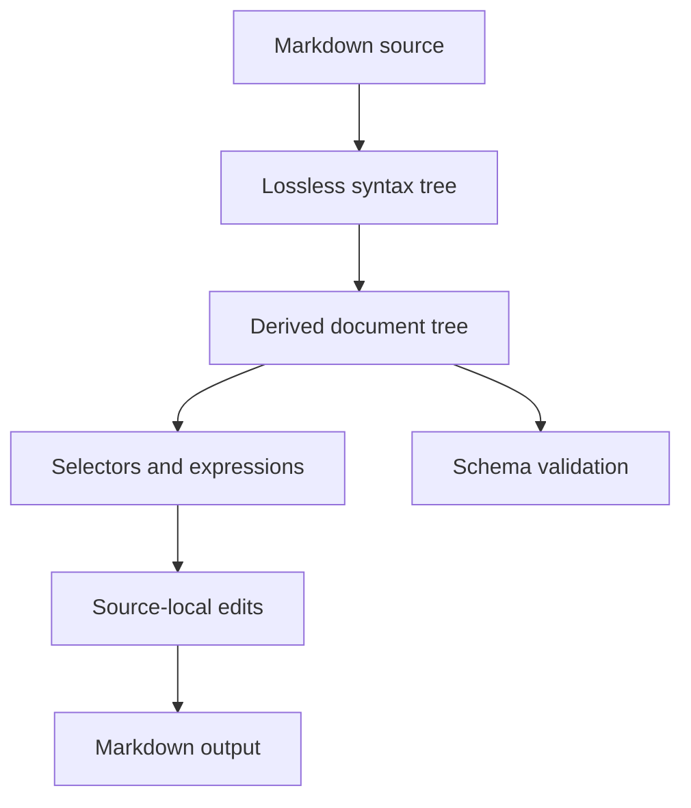

# mq specification

Status: design baseline for the first implementation

Target: `@prelude/mq` and `@prelude/mq-cli` 0.x

## 1. Purpose

`mq` is a language, library, and command-line tool for treating Markdown as
structured data. It should make common document operations as composable as
`jq` makes JSON operations:

- select sections and Markdown nodes;
- extract Markdown, text, or structured JSON;
- create, replace, insert, move, and remove content;
- validate documents against reusable schemas;
- read from files or standard input and write to files or standard output;
- expose the same capabilities as a TypeScript API.

The name describes the intent—“Markdown query”—not compatibility with jq's
syntax or data model.

## 2. Design principles

1. **Markdown remains the source of truth.** Unchanged input must round-trip
   byte-for-byte. A mutation must not reformat unrelated source.
2. **Sections are structural.** A heading owns the content after it and every
   lower-ranked heading beneath it, until a heading of equal or higher rank.
3. **Concrete and semantic trees coexist.** The concrete syntax tree preserves
   spelling and trivia; the derived document tree makes sections convenient to
   query.
4. **Queries do not mutate.** Changes are explicit operations and only reach the
   filesystem when the CLI is given `--write` or an output path.
5. **The library defines behavior.** The CLI adapts arguments, streams, files,
   diagnostics, and exit statuses to the library API.
6. **Invalid input is not disposable.** Unsupported or malformed Markdown is
   preserved as opaque source with diagnostics whenever recovery is possible.
7. **Small primitives compose.** Selectors, projections, edits, and schema rules
   remain independent rather than growing command-specific special cases.
8. **Determinism beats convenience.** Source order, stable diagnostics, and
   explicit ambiguity errors are part of the contract.

## 3. Scope

### 3.1 Initial 0.x scope

- UTF-8 Markdown with BOM and LF/CRLF preservation;
- CommonMark block structure needed for headings, paragraphs, lists, quotes,
  code, HTML, links, images, thematic breaks, and reference definitions;
- GFM tables, task-list items, strikethrough, and autolinks;
- YAML, TOML, or JSON frontmatter represented as a distinct node;
- a lossless concrete syntax tree and a derived heading/section hierarchy;
- CSS-like selectors over the derived tree;
- a small pipeline expression language for projections and edits;
- JSON-compatible Markdown schemas;
- deterministic TypeScript and CLI APIs.

CommonMark and GFM are compatibility targets, not permission to destroy syntax
the parser does not understand. Unrecognized extensions survive as opaque
nodes.

### 3.2 Explicitly deferred

- rendering Markdown to HTML;
- executing code blocks or embedded expressions;
- evaluating JavaScript from a query or schema;
- network access and remote includes;
- collaborative editing or incremental text-editor protocols;
- a stable plugin ABI;
- automatic prose rewriting;
- guarantees for non-UTF-8 input.

## 4. Architecture



The concrete syntax tree (CST) owns source ranges and exact lexemes. The derived
tree is an indexed view whose nodes point back to CST ranges. Edits produce a
patch set against the original source; serialization applies non-overlapping
patches rather than printing the entire tree.

### 4.1 Package boundaries

`@prelude/mq` owns:

- parsing and lossless rendering;
- document and section trees;
- selector and expression parsers;
- query evaluation;
- edit planning and application;
- schema loading and validation;
- structured diagnostics.

It must not read files, inspect environment variables, write to standard
streams, or terminate a process.

`@prelude/mq-cli` owns:

- argument parsing and help;
- stdin/stdout/stderr and file I/O;
- glob expansion only when explicitly requested;
- atomic in-place writes and file-mode preservation;
- human, JSON, and quiet diagnostic formats;
- mapping results to exit statuses.

Start with these two packages. Extracting more packages requires a demonstrated
independent consumer or dependency boundary.

### 4.2 Dependency policy

Prefer Node.js built-ins and `@prelude/*` packages. `@prelude/parser` is the
default parser-combinator dependency for selector, expression, and Markdown
grammars. A different runtime dependency is acceptable when implementing the
same behavior locally would create greater correctness or maintenance risk; the
choice must be recorded as an architectural decision in this specification.

**Decision — CommonMark semantic parser.** `@prelude/mq` uses
`mdast-util-from-markdown` 2.0.3, backed by micromark, to recognize CommonMark
flow and phrasing semantics. Reimplementing CommonMark's container continuation,
delimiter, HTML, and reference rules locally would create substantially greater
correctness and maintenance risk. mq does not expose mdast and does not use it
as source truth: mq retains the original source, computes its own UTF-8 ranges,
owns immutable public nodes and section indexes, and renders exclusively from
retained source. GFM behavior remains an explicit extension milestone.

**Decision — GFM semantic extensions.** The same adapter enables
`micromark-extension-gfm` 3.0.0 and `mdast-util-gfm` 3.1.0 together. This keeps
tables, task items, strikethrough, and literal autolinks on the tokenizer and
semantic tree versions designed to interoperate, without introducing another
parser or serializer.

**Decision — frontmatter semantic extensions.** The adapter enables
`micromark-extension-frontmatter` 2.0.0 and `mdast-util-frontmatter` 2.0.1 as a
paired tokenizer and tree extension. These packages enforce document-head,
container, closing-fence, and one-per-document rules while mq continues to own
source ranges and exact rendering. Reimplementing those boundary rules beside
micromark would risk disagreeing with the CommonMark parser at the document
boundary.

**Decision — bounded selector regular expressions.** `:matches` uses `re2js`
2.8.6 instead of JavaScript's backtracking `RegExp`. RE2JS is a pure-JavaScript
finite-automata engine, so matching remains linear in input length without
filesystem access, native installation steps, workers, or asynchronous API
changes. Patterns that require backreferences or lookaround are rejected; this
compatibility tradeoff materially reduces denial-of-service risk from selectors
supplied by schemas or command-line users.

## 5. Document model

### 5.1 Source coordinates

Every concrete node has a half-open byte range `[start, end)` and corresponding
one-based line/column positions. A `SourcePosition` contains a zero-based UTF-8
`byteOffset`, a one-based `line`, a one-based Unicode code-point `column`, and a
one-based `utf16Column`. A `SourceRange` contains inclusive `start` and exclusive
`end` positions. Public diagnostics therefore serve editors and terminal tools
without coordinate conversion.

The document records:

- original source text;
- optional UTF-8 BOM;
- dominant newline style and mixed-newline occurrences;
- final-newline presence;
- parse diagnostics;
- CST root and derived-tree indexes.

Node identity is stable within one parsed document and across edits that do not
replace that node's concrete range. Identity is not stable across a fresh parse
and must not be persisted in schemas.

### 5.2 Concrete syntax tree

The CST preserves every source byte. Concrete nodes include all recognized
Markdown forms, top-level blank lines, and opaque recovery nodes. Container
ranges retain marker, delimiter, escaping, indentation, and whitespace bytes
even when those lexemes are not separate public child nodes. The CST
distinguishes forms with equivalent meaning, such as ATX and Setext headings or
fenced and indented code blocks.

CommonMark tokenization occurs during document parsing, but public inline nodes
are materialized lazily by `inlines(headingOrParagraph)` and cached by container
identity. A block's `inlineRange` remains authoritative before and after that
view is requested.

Parsing uses finite defaults: 16 MiB of UTF-8 source, 100,000 tokenizer semantic
nodes (including inline nodes), nesting depth 128, and 100 diagnostics. Callers
may lower or raise these safe-integer ceilings through `ParseOptions.limits`;
`maxDiagnostics` must be at least one and the others may be zero. Retained
top-level blank-line wrappers do not consume the semantic-node budget.

Recovery boundaries are deterministic. Unsupported syntax becomes one opaque
node over the tokenizer node's exact range. A byte-limit violation skips
tokenization and preserves all content after an optional BOM as one opaque node.
Node-budget exhaustion keeps the accepted top-level prefix and preserves the
remaining suffix as one opaque node. A depth violation preserves only its
owning top-level block as opaque and resumes at the next block. These recoveries
emit `markdown.limit` warnings and unchanged rendering remains byte-identical.
When diagnostics exceed their ceiling, the final retained diagnostic becomes
`markdown.diagnostic-limit`; further diagnostics are suppressed.

### 5.3 Derived tree

The public derived model begins with these TypeScript shapes. More block and
inline variants will join the unions as their milestones land; the relationships
are normative.

```ts
type MarkdownNode = Document | Section | Heading | Block | Inline;

interface Document {
  readonly type: "document";
  readonly source: SourceText;
  readonly path?: string;
  readonly range: SourceRange;
  readonly diagnostics: readonly Diagnostic[];
  readonly cst: ConcreteDocument;
  readonly preamble: readonly Block[];
  readonly children: readonly (Block | Section)[];
  readonly sections: readonly Section[];
}

interface Section {
  readonly type: "section";
  readonly range: SourceRange;
  readonly level: 1 | 2 | 3 | 4 | 5 | 6;
  readonly heading: Heading;
  readonly title: string;
  readonly body: readonly Block[];
  readonly sections: readonly Section[];
  readonly children: readonly (Heading | Block | Section)[];
}

interface Blockquote {
  readonly type: "blockquote";
  readonly children: readonly FlowNode[];
}

interface ListBlock {
  readonly type: "list";
  readonly ordered: boolean;
  readonly start: number | undefined;
  readonly tight: boolean;
  readonly children: readonly ListItem[];
}

interface ListItem {
  readonly type: "item";
  readonly children: readonly FlowNode[];
}

interface CodeBlock {
  readonly type: "code";
  readonly language?: string;
  readonly meta?: string;
  readonly fenced: boolean;
  readonly value: string;
}

interface Frontmatter {
  readonly type: "frontmatter";
  readonly format: "yaml" | "toml" | "json";
  readonly value: string;
}

interface Definition {
  readonly type: "definition";
  readonly reference: string;
  readonly label?: string;
  readonly destination: string;
  readonly title?: string;
}

interface Table {
  readonly type: "table";
  readonly alignments: readonly ("left" | "right" | "center" | undefined)[];
  readonly children: readonly TableRow[];
}

interface TableRow {
  readonly type: "row";
  readonly header: boolean;
  readonly children: readonly TableCell[];
}

interface TableCell {
  readonly type: "cell";
  readonly alignment: "left" | "right" | "center" | undefined;
  readonly header: boolean;
  readonly inlineRange: SourceRange;
  readonly text: string;
}
```

`SourceText` retains the original string and UTF-8 byte length, an optional BOM
range, dominant newline style, non-dominant newline occurrences, and whether the
source has a final newline. The CST root and its descendants each expose a
concrete `kind`, source range, and ordered concrete children. Exact lexemes are
read from the retained source using those ranges rather than copied into both
trees.

`children` is the selector-facing order. A section's heading is its first child,
followed by body blocks and nested sections in source order. Convenience fields
such as `body` and `sections` are filtered views, not separate ownership.

Top-level headings create sections; headings nested in block quotes or list
items remain ordinary flow children and do not affect section hierarchy.
CommonMark paragraph and heading inline views include decoded text, emphasis,
strong emphasis, inline code, hard breaks, links, images, and inline HTML.
Links and images expose either decoded destinations and optional titles or a
normalized reference identifier. Definitions expose that same normalized
identifier as `reference`, their source label when present, and decoded
destination and optional title. Unsupported extension nodes remain opaque.
GFM tables expose ordered rows and cells, per-column alignment, and header
flags. Table cells participate in the same lazy `inlines` API as headings and
paragraphs. Task-list markers populate `item.checked`; strikethrough is a
recursive inline node; URL and email literals become ordinary link nodes.

The document preamble contains blocks before the first heading. Those blocks are
also the initial non-section entries in `document.children`. Frontmatter, when
present, belongs to the preamble.

Frontmatter can occur only once, immediately after an optional BOM, outside all
containers, and with a closing fence. YAML uses complete `---` fence lines,
TOML uses `+++`, and JSON uses an opening line containing `{` and a closing line
containing `}`. Fence lines may have trailing spaces or tabs and must end at a
line ending or EOF. The JSON form is therefore line-fenced; a single-line JSON
object is ordinary Markdown. `value` excludes the opening and closing lines but
retains the payload without interpreting YAML, TOML, or JSON. Format decoding
and validation are deferred to schemas.

### 5.4 Heading nesting

Heading rank creates section hierarchy using a stack:

1. A heading is nested under the nearest preceding heading with a lower numeric
   level.
2. Before adding a heading, close sections whose level is greater than or equal
   to the new heading's level.
3. If no preceding lower-level heading exists, add it at document level.
4. Missing intermediate ranks do not create synthetic sections.

For this source:

```md
# A
intro
### C
text
## B
```

the derived hierarchy is:

```text
document
└─ section A (level 1)
   ├─ paragraph "intro"
   ├─ section C (level 3)
   └─ section B (level 2)
```

The level-3 section is valid structurally but schema rules may reject skipped
ranks. Changing a heading level reparents affected following sections according
to the same algorithm.

### 5.5 Node kinds and common attributes

Initial selectors recognize these type names:

| Type | Important attributes |
| --- | --- |
| `document` | `path`, when supplied by the caller |
| `frontmatter` | `format` (`yaml`, `toml`, `json`), `value` |
| `section` | `level`, `title`, `slug` |
| `heading` | `level`, `title`, `slug`, `style` |
| `paragraph` | — |
| `blockquote` | — |
| `list` | `ordered`, `start`, `tight` |
| `item` | `checked` (`true`, `false`, or absent) |
| `code` | `language`, `meta`, `fenced` |
| `table`, `row`, `cell` | `alignment`, `header` |
| `link`, `image` | `destination`, `title`, `reference` |
| `definition` | `reference`, `label`, `destination`, `title` |
| `html`, `thematic-break`, `text` | kind-specific values |
| `emphasis`, `strong`, `inline-code`, `break` | recursive children or decoded value |
| `opaque` | `reason` |

`title` is decoded plain text. `slug` uses a documented GitHub-compatible slug
algorithm and is computed, never serialized. Duplicate slugs are allowed and
receive no implicit numeric suffix; callers that require uniqueness must use a
schema.

## 6. Selectors

Selectors are CSS-like strings parsed by `@prelude/parser`. They operate over
the derived tree and return nodes in source order without duplicates.

### 6.1 Syntax

The selector language supports:

- type selectors: `section`, `heading`, `code`;
- universal selector: `*`;
- attributes: `[level=2]`, `[title="Install"]`, `[checked]`;
- comparisons: `=`, `!=`, `^=`, `$=`, `*=`, `~=`, `>`, `>=`, `<`, `<=`;
- selector lists: `heading, code`;
- descendant and child combinators: `section code`, `section > code`;
- adjacent and general siblings: `+` and `~`;
- pseudos: `:first-child`, `:last-child`, `:nth-child(n)`,
  `:contains("text")`, `:matches(/pattern/flags)`, `:has(selector)`, and
  `:not(selector)`.

A compound may omit its type before an attribute or pseudo, so `[level=2]` and
`:first-child` imply the universal selector. Whitespace is the descendant
combinator except around an explicit combinator, attribute token, list comma, or
pseudo argument. A backslash escapes the following character in a quoted
string.

Attribute names and type names are ASCII case-insensitive. String values are
case-sensitive. Numeric and boolean attributes use typed comparisons; applying
an ordered comparison to a nonnumeric attribute is a selector type error.
Numeric values must be unquoted and boolean values must be unquoted `true` or
`false`. `^=`, `$=`, `*=`, and `~=` require string attributes; `~=` tests one
ASCII-whitespace-separated word. Presence requires the attribute to exist, even
when its value is `false`. Every other operator requires the attribute to exist,
so a missing attribute does not satisfy `!=`.

`:contains` searches decoded plain text recursively. `:matches` uses JavaScript
regular-expression literal delimiters and the RE2-compatible syntax subset.
Flags are limited to `i`, `m`, `s`, and the accepted no-op compatibility flag
`u`; duplicates, other flags, invalid patterns, lookaround, and backreferences
are rejected at compile time. Patterns are limited to 256 UTF-16 code units and
execute with RE2JS's linear-time finite-automata engine.

`:first-child`, `:last-child`, and the one-based positive integer
`:nth-child(n)` use selector-facing children; a root without a parent satisfies
none of them. `:has` accepts relative selector lists. An omitted leading
combinator means descendant, while `>`, `+`, or `~` means child, adjacent
sibling, or general sibling relative to the candidate. `:not` accepts ordinary,
non-relative selector lists.

### 6.2 Section behavior

`section` selects the entire section range: heading, direct body, and descendant
sections. `section > paragraph` selects direct body paragraphs only because a
nested section is a separate child. `section heading` may select descendant
headings; `section > heading` selects only that section's own heading.

Example selectors:

```css
section[level=2]
section[title="Installation"] > code[language="sh"]
section:has(> heading[title="API"])
item[checked=false]
heading + paragraph
```

### 6.3 Selector API

The core API exposes compiled selectors so repeated queries parse only once:

```ts
const selector = compileSelector('section[level=2]');
const matches = select(document, selector);
```

Syntax failures are returned as diagnostics with ranges into the selector. No
selector function throws for ordinary invalid user input; convenience `orThrow`
adapters may be supplied separately.

`compileSelector` returns an immutable `Result<CompiledSelector>`. `select`
returns a frozen readonly node array, includes the supplied root by default, and
deduplicates node identities while preserving selector-facing source order.
Passing `{ includeRoot: false }` starts traversal at the root's children.

Malformed syntax uses `selector.syntax`, invalid typed operators or values use
`selector.attribute-type`, and invalid, unsupported, or overlong regular
expressions use `selector.regex`. Each is an immutable error diagnostic over the
selector source.

Selector compilation accepts at most 65,536 UTF-8 source bytes, 64 selectors
across lists (including nested lists), 256 total combinator steps, 256 attribute
and pseudo tests, and 16 nested `:has`/`:not` levels. Exceeding any ceiling
returns `selector.limit` before evaluation.

## 7. Expressions

The expression language provides jq-like pipelines without copying jq syntax.
It is intentionally small in the first implementation and has no general-purpose
variables, loops, imports, or user-defined functions.

### 7.1 Data flow

An expression consumes a document and emits a stream of values. Values are
documents, Markdown nodes, strings, numbers, booleans, null, arrays, or objects.
Streams preserve document order. `|` passes every value on its left to the stage
on its right.

Initial query built-ins are:

| Expression | Result |
| --- | --- |
| `.` | current value |
| `select("selector")` | matching nodes below the current document or node |
| `markdown` | exact Markdown for each node |
| `text` | decoded plain text for each node |
| `json` | stable JSON representation of each value |
| `count` | number of values in the incoming stream |
| `first`, `last` | first or last incoming value |
| `array` | collect the incoming stream into one array |

Examples:

```mq
select("section[level=2]") | markdown
select("code[language=ts]") | text
select("item[checked=false]") | json | array
select("heading") | count
```

The default CLI expression is `.`. A bare selector is not an
expression; requiring `select(...)` keeps selector syntax independently usable
by schemas and the TypeScript API.

Expression syntax is case-sensitive and uses this initial grammar, with
whitespace permitted around every token:

```text
expression = stage ("|" stage)*
stage      = "." | select | "markdown" | "text" | "json"
           | "count" | "first" | "last" | "array"
select     = "select" "(" json-string ")"
```

The `select` argument is one RFC 8259 JSON string. Expression compilation also
compiles that string as a selector, so neither expression syntax nor nested
selector syntax is reparsed during evaluation. Keywords do not accept call
parentheses unless the grammar shows them.

The core API exposes immutable compiled expressions for reuse:

```ts
const expression = compileExpression('select("heading") | text | array');
```

`compileExpression` consumes the complete source. Ordinary invalid expression
or nested selector input returns an immutable failure result rather than
throwing. Diagnostic ranges use expression-source coordinates and identify the
unexpected token, missing-token insertion point, or complete selector string
argument responsible for the failure.

`evaluate(document, expression)` starts with a one-value stream containing the
document and returns a frozen readonly `QueryValue[]`. The compiled expression
must come from `compileExpression`; passing an object that only resembles one is
a programmer error. A query value is a Markdown node, a JSON primitive, a
canonical JSON object, or a readonly array of query values.

Pipeline stages operate on the complete incoming stream. `.`, `markdown`,
`text`, and `json` map values; `select` maps each input node to zero or more
matches and concatenates those matches in input order; `count`, `first`, `last`,
and `array` reduce the complete stream. `count` and `array` always emit one
value, including for an empty stream. `first` and `last` emit no value for an
empty stream. Node-only stages (`select`, `markdown`, and `text`) emit no value
for incompatible inputs. `select` includes its current root, matching the
default selector API behavior. Streams and collected arrays are immutable.

`markdown` slices the selected node's UTF-8 source range from the evaluated
document exactly. `text` recursively joins direct child text with `\n`, uses
decoded heading titles and text-inline values, normalizes retained block line
endings to `\n`, and removes one final block newline. Blank lines emit an empty
string. Frontmatter and definitions are out-of-band and also emit an empty
string. Until another retained node has a decoded inline or block view, its
source content remains literal in this projection.

`json` recursively converts values to deeply frozen JSON-compatible data.
Arrays preserve order and object keys use ascending code-unit order so
`JSON.stringify` is deterministic. Markdown nodes use these semantic shapes;
source ranges and concrete parser nodes are deliberately excluded:

| Node | JSON fields |
| --- | --- |
| document | `type`, optional `path`, recursive `children` |
| section | `type`, `level`, `title`, recursive `children` |
| heading | `type`, `level`, `title`, `style` |
| paragraph | `type`, projected `text` |
| blank line | `type` |
| frontmatter | `type`, `format`, undecoded `value` |
| definition | `type`, `reference`, optional `label`, `destination`, optional `title` |
| blockquote | `type`, recursive `children` |
| list | `type`, `ordered`, optional `start`, `tight`, recursive `children` |
| item | `type`, optional `checked`, recursive `children` |
| code | `type`, `fenced`, optional `language` and `meta`, decoded `value` |
| HTML | `type`, `value` |
| thematic break or hard break | `type` |
| emphasis or strong | `type`, recursive `children` |
| inline code | `type`, `value` |
| link | `type`, destination or reference, optional title, recursive `children` |
| image | `type`, `alt`, destination or reference, optional title |
| table | `type`, alignments (`null` when absent), recursive `children` |
| row | `type`, `header`, recursive `children` |
| cell | `type`, optional `alignment`, `header`, projected `text` |
| strikethrough | `type`, recursive `children` |
| text inline | `type`, `value` |
| opaque block or inline | `type`, `reason`, exact `markdown` |

### 7.2 Source patches

`SourcePatch` is a half-open original `SourceRange` plus replacement text.
`planSourcePatches(source, patches)` validates that every position exactly
matches a UTF-8 boundary and line/column coordinate in that source, copies and
sorts patches by original start then end, and returns an immutable opaque plan.
`applySourcePatches(plan)` accepts only such a plan and returns immutable output
text, its UTF-8 byte length, and a source map.

Non-empty ranges conflict when their half-open intervals overlap. Two
insertions at the same byte, or an insertion at the start of a non-empty patch,
are ambiguous because their output order has no declared affinity. An insertion
at a non-empty patch's end is allowed and follows that replacement. Adjacent
non-empty ranges are allowed. Conflicts fail planning with
`edit.patch-overlap` or `edit.patch-ambiguity`, include both original ranges as
notes, and cannot produce output. Invalid or foreign coordinates use
`edit.range`.

The source map is an ordered partition into `retained` and `replacement`
segments. Every segment records an original and generated range. Deletions have
a zero-width generated range; insertions have a zero-width original range.
Retained segments are copied exactly, while replacement segments make no
character-level mapping claim. Both application and map generation are linear
after the plan's O(p log p) sort.

### 7.3 Edit built-ins

Edit expressions consume a document and emit one edited document:

| Function | Effect |
| --- | --- |
| `replace(selector, markdown)` | replace every match |
| `remove(selector)` | remove every match |
| `append(selector, markdown)` | append as the last child of every match |
| `prepend(selector, markdown)` | prepend as the first non-heading child |
| `before(selector, markdown)` | insert before every match |
| `after(selector, markdown)` | insert after every match |
| `setTitle(selector, string)` | change matching section/heading titles |
| `setAttribute(selector, name, value)` | update a supported semantic attribute |

`markdown("...")` creates a parsed fragment value. Fragment parse errors stop
the edit unless recovery is explicitly enabled by a future option.

All targets are resolved against the input snapshot before edits begin. The
engine rejects overlapping or structurally conflicting patches rather than
depending on application order. Operations that cannot apply to a node kind
produce an edit diagnostic.

The TypeScript patch-planning API exposes immutable `replaceEdit`, `removeEdit`,
`beforeEdit`, `afterEdit`, `prependEdit`, `appendEdit`, `setTitleEdit`, and
`setAttributeEdit` operation values. `planEdits(document, operations)` resolves
each compiled selector once in operation then source order and feeds every patch
to the atomic source-patch planner. No matches produce no patches. Fragment
replacement preserves a target's final newline when present. Before/after use
the target boundaries; prepend/append currently accept document and section
containers, and document prepend stays after leading frontmatter.

`setTitleEdit` accepts headings or sections, rejects newlines, and escapes plain
text Markdown punctuation before replacing only `inlineRange`. Source-local
attribute edits currently support integer `heading.level` on ATX headings and
boolean `item.checked` when a task marker already exists. Other target or
attribute combinations fail with `edit.target` or `edit.attribute`; invalid
title values use `edit.value`.

`applyEdits(document, operations)` is the immutable transaction boundary. It
plans every operation first, applies one validated patch set, reparses the
result, preserves the optional document path, and returns a new frozen
`Document` whose `sourceMap` maps from the immediate input snapshot. A planning
failure returns no document. An empty patch plan returns the original document
identity. Non-empty edits rebuild the parsed tree because public ranges are
immutable and even retained nodes can shift; a fresh parse of rendered output
must have the same semantic JSON shape as the returned snapshot.

Examples:

```mq
remove("section[title='Deprecated']")
setTitle("section[title='Setup']", "Installation")
append("section[title='Examples']", markdown("\n```ts\nrun()\n```\n"))
```

Moving and copying nodes are deferred until identity and overlap semantics have
been exercised by the initial edit set.

### 7.4 Formatting inserted content

Existing source is never normalized. Inserted fragments use their supplied
spelling where possible. The edit planner may add only the minimum boundary
newlines needed to make the fragment a valid sibling or child. It must preserve
the target document's dominant newline style for generated boundary text.

`parseMarkdownFragment(source)` reuses `parse` and returns an immutable fragment
with its lossless document view. `planFragmentInsertion(document, fragment, at)`
accepts an exact source position at the document start/end or a complete line
boundary and returns one zero-width `SourcePatch`. Mid-line positions and the
position between `\r` and `\n` fail with `edit.fragment-boundary`. Empty
fragments are no-op patches.

The fragment's bytes are never normalized. If a non-empty source side and the
facing fragment side do not already contain a newline, planning adds exactly one
newline. Generated boundaries use the document's dominant style, or LF when the
document has no newline. Thus supplied LF inside a fragment remains LF even when
generated boundaries are CRLF, and mixed-newline ties retain the parser's first
encountered style.

Heading levels in an inserted section remain exactly as supplied. A convenience
operation for rebasing heading levels may be added later; implicit rebasing is
forbidden.

## 8. Schemas

Schemas validate document structure and content without executing code. The
portable form is JSON; the TypeScript API accepts the equivalent typed object.

### 8.1 Shape

```json
{
  "$schema": "https://prelude.dev/mq/schema/v1",
  "name": "Architecture decision record",
  "rules": [
    {
      "selector": "document > section[level=1]",
      "count": { "min": 1, "max": 1 }
    },
    {
      "selector": "section[title='Status']",
      "count": { "exact": 1 },
      "text": { "enum": ["Proposed", "Accepted", "Rejected", "Superseded"] }
    },
    {
      "selector": "heading",
      "unique": "slug"
    }
  ]
}
```

A v1 schema contains:

- `$schema`: required schema language identifier;
- `name` and `description`: optional metadata;
- `rules`: ordered validation rules;
- `options`: document-wide checks such as `headingRanks: "contiguous"`;
- `frontmatter`: an optional JSON Schema applied to decoded frontmatter.

The identifier is exactly `https://prelude.dev/mq/schema/v1`, exported as
`MQ_SCHEMA_V1`. `schemaMetaSchemaV1` is the deeply immutable Draft 2020-12
meta-schema for the extension-free core. The strict loader is normative when
extensions are enabled.

`loadSchema(input, options?)` accepts either JSON source text or equivalent
plain TypeScript data and returns `Result<MarkdownSchema>`. `options.path`
identifies the schema file in diagnostics. JSON source rejects duplicate keys,
non-JSON whitespace, invalid escapes, non-finite numbers, and trailing input.
Typed input rejects cycles, non-plain objects, accessors, non-enumerable or
symbol properties, non-finite numbers, `undefined`, functions, and bigints.
Successful schemas are copied into deeply immutable portable JSON data.

The exact v1 constraint shapes are:

```ts
interface MarkdownSchemaRule {
  readonly selector: string;
  readonly count?: { readonly exact?: number; readonly min?: number; readonly max?: number };
  readonly text?: {
    readonly minLength?: number;
    readonly maxLength?: number;
    readonly pattern?: string;
    readonly enum?: readonly string[];
  };
  readonly markdown?: { readonly pattern: string };
  readonly attributes?: {
    readonly required?: readonly string[];
    readonly equals?: Readonly<Record<string, string | number | boolean>>;
    readonly ranges?: Readonly<Record<string, { readonly min?: number; readonly max?: number }>>;
  };
  readonly children?: {
    readonly allowed?: string;
    readonly required?: readonly string[];
    readonly order?: readonly string[];
  };
  readonly unique?: string;
  readonly message?: string;
}
```

`options.headingRanks`, when present, is `"contiguous"`.
`options.extensions`, when present, is `"allow"`; it permits `x-` fields on
mq-owned schema objects, preserves their JSON values, and gives them no v1
effect. Without that option all unknown fields, including `x-` fields, fail.
The embedded `frontmatter` object belongs to JSON Schema and is therefore opaque
to mq's unknown-field check at this stage.

Rules require a non-empty, valid selector and at least one constraint other than
`message`. Child selectors are compiled with the same selector grammar.
Cardinality and string-length bounds are non-negative integers; `exact` excludes
`min` and `max`; every minimum must not exceed its maximum. Constraint objects
and selector lists must not be empty. Attribute names use the selector
identifier grammar. Patterns compile with the same linear-time RE2 engine as
selector regexes. `unique` is a non-empty attribute or projection name whose
evaluation is defined by the rule implementation milestone.

### 8.2 Rules

Every rule begins with a selector. It may constrain:

- `count`: `exact`, `min`, and/or `max` matches;
- `text`: `minLength`, `maxLength`, `pattern`, or `enum`;
- `markdown`: `pattern`;
- `attributes`: required names and typed equality/range constraints;
- `children`: selectors allowed, required, and their ordering;
- `unique`: an attribute or projection that must be unique among matches;
- `message`: a custom human-readable suffix, never a replacement for the
  machine-readable diagnostic code.

Rules are evaluated in file order and diagnostics are sorted by source position,
then rule order. A selector matching no nodes is not itself an error unless its
`count` constraint requires matches.

The internal rule engine evaluates selectors with the document root included.
`count` produces one diagnostic for each failed bound; too-many failures point
at the first excess match and too-few failures point at the document. Text
length counts Unicode code points. Text and Markdown patterns search for a
match; Markdown patterns receive the node's exact source slice. Text enums and
attribute equality use exact typed equality. Attribute ranges require a numeric
attribute and include both endpoints.

Child constraints inspect immediate semantic children. `allowed` is one
selector list; every child must match it. Each `required` selector must match at
least one child. `order` lists selector groups in ascending order; unmatched
children are ignored and the first listed group wins when a child matches more
than one. Heading-rank continuity requires the first heading to have rank 1 and
permits increases of at most one; decreases are unrestricted.

`unique` resolves an ordinary semantic attribute, or the `text` and `markdown`
projections. Missing projections and repeated typed values fail. A duplicate
points at the repeated node and notes the first occurrence. Per-node checks are
emitted in constraint order, then all diagnostics are stably sorted by source
byte offset, rule order, and emission order. Document-wide option diagnostics
sort before rule diagnostics at the same position. Rule messages are appended
to the standard message.

Rule evaluation uses `schema.count`, `schema.text-min-length`,
`schema.text-max-length`, `schema.text-pattern`, `schema.text-enum`,
`schema.markdown-pattern`, `schema.attribute-required`,
`schema.attribute-equals`, `schema.attribute-range`, `schema.child-allowed`,
`schema.child-required`, `schema.child-order`, `schema.unique`, and
`schema.heading-ranks`. The later public-API milestone defines the exported
validation result wrapper around this engine.

Frontmatter decoding is explicit and never changes the retained Markdown
source. YAML uses the YAML 1.2 core schema with string mapping keys, unique keys,
no custom or known extension tags, and zero aliases. TOML follows TOML 1.1;
date/time values become their ISO source-equivalent strings. JSON uses the same
strict parser as schema source, including duplicate-key rejection. All formats
must produce finite, acyclic portable JSON values, and successful values are
deeply immutable. A decode failure returns `schema.frontmatter-decode` at the
frontmatter node while `render(document)` remains byte-for-byte unchanged.

The `frontmatter` member is compiled as strict JSON Schema Draft 2020-12 during
schema loading. Invalid schemas, unresolved remote references, unknown formats,
and `$async` schemas fail with `schema.frontmatter-schema`; validation never
uses the filesystem or network. Validation uses all errors without coercion,
defaults, mutation, or custom keywords. Each failure is `schema.frontmatter`
at the retained frontmatter node. A document without frontmatter has nothing to
decode; cardinality requirements remain ordinary mq rules.

**Dependency decision — portable data languages.** `yaml` 2.9.0 is used because
its YAML 1.2 implementation passes the YAML test suite and exposes strict,
alias-limited parsing; `smol-toml` 1.7.0 is used for TOML 1.1 conformance and
date-kind preservation; both are typed, browser-capable, and have no runtime
dependencies. Ajv 8.20.0 supplies strict Draft 2020-12 validation in Node and
browsers. These dependencies materially reduce parser and standards-compliance
risk compared with maintaining mq-specific YAML, TOML, or JSON Schema subsets.

Schema-loading diagnostics use `schema.json-syntax`,
`schema.json-duplicate-key`, `schema.version`, `schema.required`, `schema.type`,
`schema.unknown-key`, `schema.constraint`, `schema.selector`, and
`schema.pattern`. JSON diagnostics point at the offending token; typed-object
diagnostics identify an escaped JSON Pointer in the message. Diagnostics retain
deterministic object, rule, and constraint order.

### 8.3 Diagnostics

Diagnostics are data, not formatted strings:

```ts
interface Diagnostic {
  readonly code: string;
  readonly severity: "error" | "warning";
  readonly message: string;
  readonly source?: "markdown" | "selector" | "expression" | "edit" | "schema";
  readonly path?: string;
  readonly range?: SourceRange;
  readonly notes?: readonly DiagnosticNote[];
}
```

Codes are stable within a major version. Human wording may improve in minor
versions. Parse, query, edit, and schema failures all use this representation.

Validation diagnostics use the selected Markdown node as their primary `path`
and `range`. Every rule diagnostic includes a note named
`Schema rule N is defined here.` with the schema path and, for JSON source, the
exact rule-object range. Diagnostics for typed schemas retain the schema path
without inventing a source range. Uniqueness diagnostics additionally note the
first occurrence. Notes and diagnostics are deeply immutable.

Messages state the failed constraint and actionable actual/expected values;
custom rule text is appended as a suffix. Within one document diagnostics use
the source/rule/emission ordering defined above. When callers validate several
documents, each document's ordered diagnostics are concatenated in caller input
order. Human and JSON adapters consume this same array without re-sorting;
`JSON.stringify` therefore has stable diagnostic, note, and document order.

Fallible public functions return a discriminated `Result<T>`. Successes contain
`ok: true`, a `value`, and any recovery diagnostics. Failures contain `ok: false`
and at least one diagnostic. Result objects and their diagnostic arrays are
immutable; ordinary invalid input is represented as failure data rather than a
thrown exception.

## 9. TypeScript API

The intended top-level API is functional and explicit:

```ts
import {
  compileSelector,
  parse,
  render,
  select,
  validate,
} from "@prelude/mq";

function inspect(source: string) {
  const parsed = parse(source, { path: "README.md" });
  if (!parsed.ok) return parsed;

  const compiled = compileSelector("heading");
  if (!compiled.ok) return compiled;

  return {
    headings: select(parsed.value, compiled.value),
    output: render(parsed.value),
  };
}
```

`validate(document, schema, options?)` accepts strict JSON schema source, an
equivalent typed schema object, or a value previously returned by `loadSchema`.
Schema-load failures and rule violations return `Failure`; a valid document
returns `Success<Document>` containing the identical document object. The
optional schema `path` is retained in rule-definition notes. The function does
not read files or mutate either input.

Fallible operations return discriminated results. Ordinary syntax, validation,
and edit failures do not throw. Programmer errors, such as passing an object
that violates a compiled internal contract, may throw.

Public collections are readonly. Mutations return a new document snapshot that
shares the complete original identity for no-op edits and otherwise rebuilds
range-bearing indexes from retained source plus replacements.

The package exports JavaScript, declarations, and source maps as native ESM. It
targets maintained Node.js releases starting with Node 24. A browser build is
not an initial release requirement, but core code must avoid Node-only I/O so a
future browser export is possible.

Packed packages include `dist/`, their matching `src/` map targets, and only the
CLI's executable `bin/` entry beyond package metadata. Workspace dependencies
are rewritten to the packed version. Both manifests publish publicly with npm
provenance enabled and require Node 24 or newer. `pnpm check` packs both
workspaces and installs the tarballs into an isolated consumer, where strict
NodeNext declarations, ESM imports, source maps, and the executable `mq` wiring
must work without repository files or workspace links.

## 10. CLI

### 10.1 Invocation

```text
mq [options] [expression] [file ...]
mq validate --schema <schema.json> [file ...]
```

With no files, `mq` reads one document from stdin. `-` names stdin explicitly.
Multiple input documents are evaluated independently in argument order.
The first positional argument is always the expression and every remaining
positional argument is an input path; use `.` explicitly when querying files
with the default expression. Options may occur before or after positionals
until `--`, which only ends option recognition. Repeated `-` operands evaluate
the same cached stdin text independently. `--null-input` evaluates one empty
document without reading stdin and rejects file operands.

Initial options:

| Option | Meaning |
| --- | --- |
| `-r`, `--raw-output` | write string results without JSON quoting |
| `-j`, `--json` | encode every result, including selected nodes, as JSON |
| `-q`, `--quiet` | suppress results; use only the exit status |
| `-n`, `--null-input` | start with an empty document instead of reading input |
| `-w`, `--write` | atomically replace each named input file |
| `-o`, `--output <path>` | write the single result to a new path |
| `--schema <path>` | validate the resulting document before output/write |
| `--fail-empty` | fail when the expression emits no values |
| `--color <auto|always|never>` | diagnostic color policy |
| `--diagnostics <human|json>` | stderr diagnostic format |
| `-h`, `--help` | print read-only query usage and exit successfully |

The query CLI implements `--raw-output`, `--json`, `--quiet`, `--null-input`,
`--fail-empty`, `--color`, `--diagnostics`, `--write`, `--output`, and
`--schema`. `--json` and `--raw-output` are mutually exclusive. Boolean flags
reject attached values; valued long options accept either a following argument
or `=value`.

With query `--schema`, expression compilation and one schema load complete
before any Markdown is read. Each input is evaluated first. A sole document
result is the validation candidate; a non-document query projection validates
its unchanged input document. Write modes retain their separate requirement for
exactly one document result and do not validate an ineligible primitive or node
stream. Diagnostics remain in input order, but all stdout and all write calls
are delayed until every candidate passes. One violation suppresses the whole
requested output/write operation and exits 1; no temporary file is opened and
existing destinations and originals remain byte-for-byte unchanged.

`mq validate --schema <schema.json> [file ...]` is the dedicated validation
adapter. It loads and compiles the schema before reading any Markdown, then
parses and validates files independently in argument order; omitted files read
stdin and repeated `-` operands reuse its cached text. It emits no stdout.
Schema-language and Markdown parse errors exit 2, violations exit 1, I/O errors
exit 3, and the highest status wins without changing diagnostic input order.
The command accepts `--color`, `--diagnostics`, and `--help`; query, output, and
write options are usage errors.

`--write` rejects stdin, duplicate paths, query results that are not exactly one
document per input, and any parse/edit/schema error. It writes a sibling
temporary file, copies the original mode, flushes and closes it, then renames it
over the original. A failure must leave the original file intact. `--output`
accepts exactly one input (including stdin or `--null-input`) and one document
result, then uses the same atomic sibling-temp workflow without original-mode
copying. Explicit write modes produce no stdout and write `render(document)`
bytes rather than query-output framing.

Write-result validation completes before a temporary file is opened. Failures
while opening, writing, copying permissions, flushing, closing, or renaming a
temporary file preserve the original bytes. Failed temporary files are removed
on a best-effort basis; a cleanup failure never replaces the primary error.

The shell, not mq, performs ordinary glob expansion. A future explicit glob
option may provide cross-platform behavior.

### 10.2 Output

Node selections default to Markdown. Primitive and structured values default to
JSON, one compact value per line. `--raw-output` affects strings only. Multiple
documents never acquire separator text that could be confused with source
Markdown. The CLI therefore rejects Markdown node output from multiple inputs
unless `--json` is used; callers may also process each file independently until
a record-separator option is specified. Quiet mode performs evaluation and exit
status checks but suppresses output, so this multi-input framing restriction
does not apply.

Node output is the concatenation of each exact source slice with no added
separator. JSON values and JSON-quoted strings end with `\n`; raw strings also
end with one framing `\n`. `--json` converts Markdown nodes and collected nodes
through the library's canonical JSON representation before encoding them.

Human diagnostics go to stderr. Data goes to stdout. In-place writes produce no
stdout unless an explicit reporting option is added later. Human diagnostics
use `path-or-source:line:column: severity[code]: message` when a range is
available and omit the location suffix otherwise. `--color=always` colors the
severity label, `never` emits no escapes, and `auto` colors only for a TTY.
Diagnostic notes follow as `path-or-source:line:column: note: message` lines.
JSON diagnostics are one compact diagnostic object per line. Expression
compilation happens before any input is read; input diagnostics and results
otherwise preserve input order.

The checked-in query and validation workflow guides cover help, stdin, ordered
files, section Markdown, text, canonical JSON, collection, empty results,
schema violations, and diagnostics. Their console transcripts are executable
conformance examples run against the workspace-installed binary.

### 10.3 Exit statuses

| Status | Meaning |
| --- | --- |
| `0` | successful evaluation or valid schema |
| `1` | no result under `--fail-empty`, or schema violations |
| `2` | CLI usage, parse, selector, expression, or edit error |
| `3` | filesystem or other I/O error |

For multiple files the highest applicable status wins, while diagnostics remain
in input order. `--write` is all-or-nothing per file, not across all files.

## 11. Correctness invariants

Every release must protect these properties:

1. `render(parse(source)) === source` for every accepted or recoverable UTF-8
   input, including mixed newlines and missing final newlines.
2. A query never changes a document or its source.
3. Matches are unique and ordered by source range.
4. Heading nesting follows section 5.4 for ATX and Setext headings.
5. An edit changes only target ranges and required boundary text.
6. Conflicting edits fail before any source patch is applied.
7. Re-parsing rendered edited output produces the same derived structure.
8. CLI and direct library evaluation produce equivalent values and diagnostics.
9. Schema validation is deterministic and has no filesystem, network, clock, or
   code-execution capability.
10. In-place write failures preserve the original file.

Property tests should generate headings, block boundaries, delimiter spellings,
and newline variants. Conformance fixtures should retain the original source and
expected derived-tree snapshot together.

The bounded language fuzz suite uses seed `0x6d71f022` for 512 Markdown/edit
cases and 1,024 selector, expression, and schema cases under 15-second test
timeouts. Markdown cases require exact parse/render identity; failed edits must
leave the original snapshot unchanged, and successful edits must preserve every
retained source-map byte range before reparsing. Language compilers must return
ordinary invalid input as failure data, and accepted values are executed to
cover evaluator boundaries. Schema cases include arbitrary syntax, recursively
generated portable JSON, and typed rule skeletons. Every discovered defect is
reduced to a permanent readable regression while the seed remains fixed.

The parser conformance suite pins all 652 CommonMark 0.31.2 examples through the
`commonmark-spec` development package. Every input must round-trip, and examples
in supported sections compare their reference HTML markers with mq semantic node
counts. Selected GFM extension inputs are adapted from `cmark-gfm` commit
`587a12bb54d95ac37241377e6ddc93ea0e45439b` and cover tables, cell mismatches,
embedded pipes, strikethrough, autolink robustness, footnote opacity,
strikethrough/autolink interoperation, and task items. Fixture attribution and
CC BY-SA 4.0 terms live beside the tests.

Intentional semantic deviations from the CommonMark-only corpus are pinned:
example 96 is recognized as mq YAML frontmatter, and examples 602, 608, 611, and
612 use GFM literal-autolink behavior. In example 606, the GFM tokenizer creates
inline nodes without source positions; mq preserves that inline range as one
opaque node instead of exposing semantic nodes with invented ranges.

The API/CLI equivalence suite runs shared source and expression fixtures through
the exported library functions and the workspace-installed `mq` binary. It
compares canonical values, default/raw/JSON serialization, expression and parse
diagnostics, multi-file ordering, and empty-stream status behavior.

## 12. Performance and limits

The first implementation optimizes for correctness, then linear behavior:

- parsing should be O(source length);
- section derivation should be O(number of block nodes);
- a compiled simple selector should be O(number of candidate nodes);
- regular-expression matching should be O(decoded text length) with patterns
  capped at 256 UTF-16 code units;
- rendering an unchanged document should avoid rebuilding its full string;
- edits should sort patches once, O(p log p), then apply them linearly.

The CLI uses the finite library defaults for byte, node, nesting-depth,
diagnostic, and selector complexity limits. Source-limit recovery is reported as
warnings rather than crashes and always retains the original bytes.

The exported, deeply immutable `resourceLimits` object is the source of truth:

| Area | Defaults |
| --- | --- |
| Markdown | 16 MiB source; 100,000 nodes; depth 128; 100 diagnostics |
| selector | 64 KiB source; 64 list members; 256 steps/tests; nesting 16; regex 256 code units |
| expression | 64 KiB source; 256 stages |
| schema loading | 1 MiB source; depth 64; 100,000 JSON values; 256 rules; 100 diagnostics |
| validation | 1,000 diagnostics |

Excess expression or schema input fails with `expression.limit` or
`schema.limit`; diagnostic truncation ends with `schema.diagnostic-limit`.
Markdown retains its lossless opaque recovery behavior. These values admit
large editor and build inputs while bounding worst-case semantic work. Tests pin
every exported value and its rejection boundary.

No 0.x throughput number is a compatibility promise. Benchmarks should include
large generated documents, deeply nested blockquotes/lists, many headings, and
adversarial selector patterns.

`pnpm benchmark` measures seven-run medians for parse, select, unchanged render,
edit/reparse, and validation across 100–10,000 headings and nesting depths
8–96. The dated local baseline lives in `docs/performance.md`; measurements are
informative until stable hosted-runner data justifies CI thresholds.

## 13. Compatibility and versioning

Packages follow semantic versioning. Before 1.0, public API and language changes
may occur in minor releases, but each change requires release notes and updated
fixtures. Schema files carry an explicit language URL so validators can reject
unsupported versions rather than guessing.

The following eventually require a major version after 1.0:

- changing section nesting;
- changing selector matching or source order;
- changing edit conflict resolution;
- removing a diagnostic code;
- changing CLI exit status meaning;
- changing the schema language incompatibly.

## 14. Acceptance examples

These examples anchor the initial vertical slices.

### Query nested sections

```md
# Project
intro
## Install
pnpm install
### Linux
Use Node 24.
## License
MIT
```

`select("section[title='Install'] > paragraph") | text` emits `pnpm install` but
not `Use Node 24.`. `select("section[title='Install'] paragraph") | text` emits
both paragraphs in source order.

### Preserve unrelated formatting

Applying `setTitle("section[title='Install']", "Installation")` changes only the
heading's inline source. Blank lines, list markers, fence length, newline style,
and the remainder of the document stay byte-identical.

### Reject ambiguous edits

Replacing a section and also replacing a paragraph inside that section in the
same expression is an overlap error. mq reports both target ranges and writes
nothing.

### Validate a template

A schema requiring exactly one level-1 section and sections named `Status` and
`Context` reports missing matches at the document range. Duplicate `Status`
sections report each duplicate range in stable source order.

## 15. Deferred decisions

These decisions should be made only with implementation evidence:

- the exact GitHub-compatible slug variant and Unicode normalization behavior;
- safe limits or an alternative engine for `:matches`;
- syntax and conflict semantics for move/copy operations;
- browser and WASM packaging;
- extension/plugin contracts;
- multi-document output framing.

Until resolved, implementations must not accidentally expose provisional
behavior as a documented public contract.
